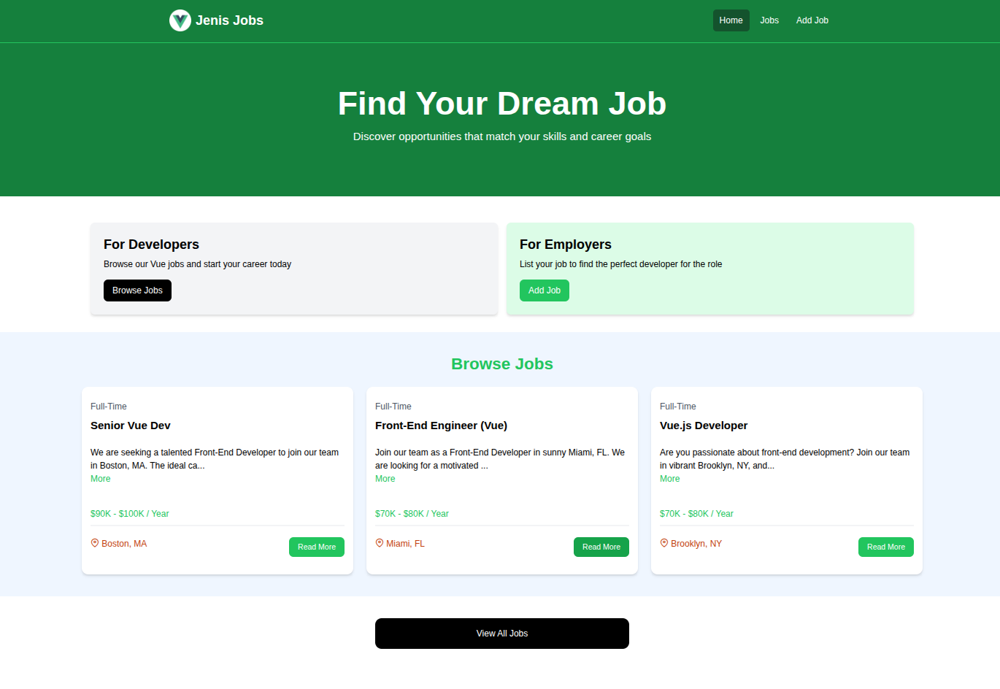
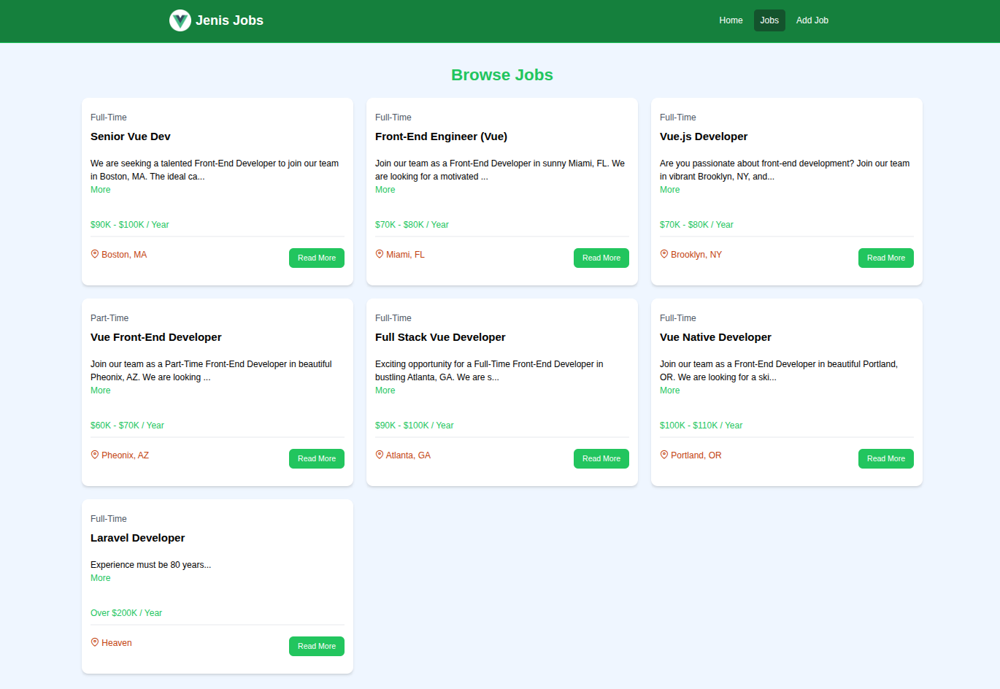
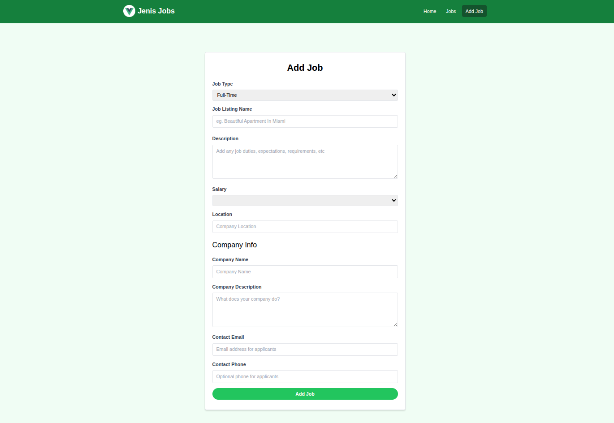
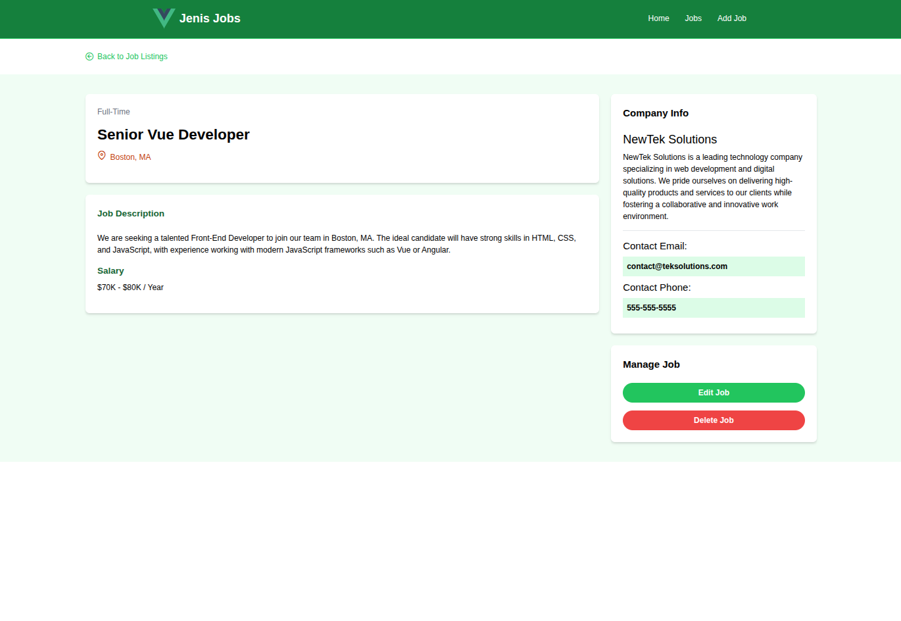

# Jenis Jobs Project

This is the jobs listing project from the [Jenis Damraliya](https://damraliyajenis.web.app).

## Screenshots

### 🏠 Home Page


### 🔍 Browse Jobs Page


### ➕ Add Job Page


### 📋 Job Listing Page


## Usage

This project uses JSON-Server for a mock backend.

### Install Dependencies

```bash
npm install
```

### Run JSON Server

The server will run on http://localhost:8000

```bash
npm run server
```

### Run Vite Frontend

Vue will run on http://localhost:3000

```bash
npm run dev
```
